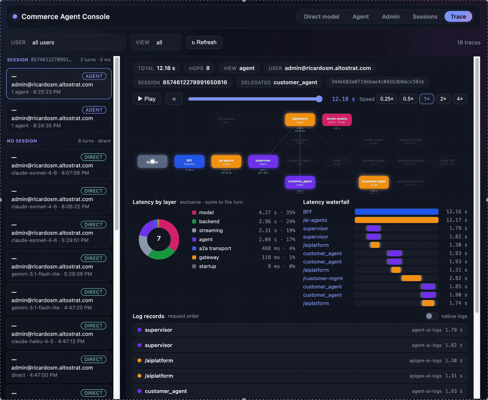
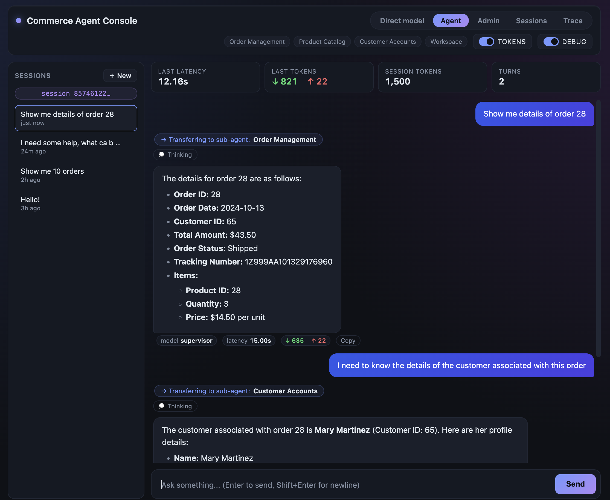
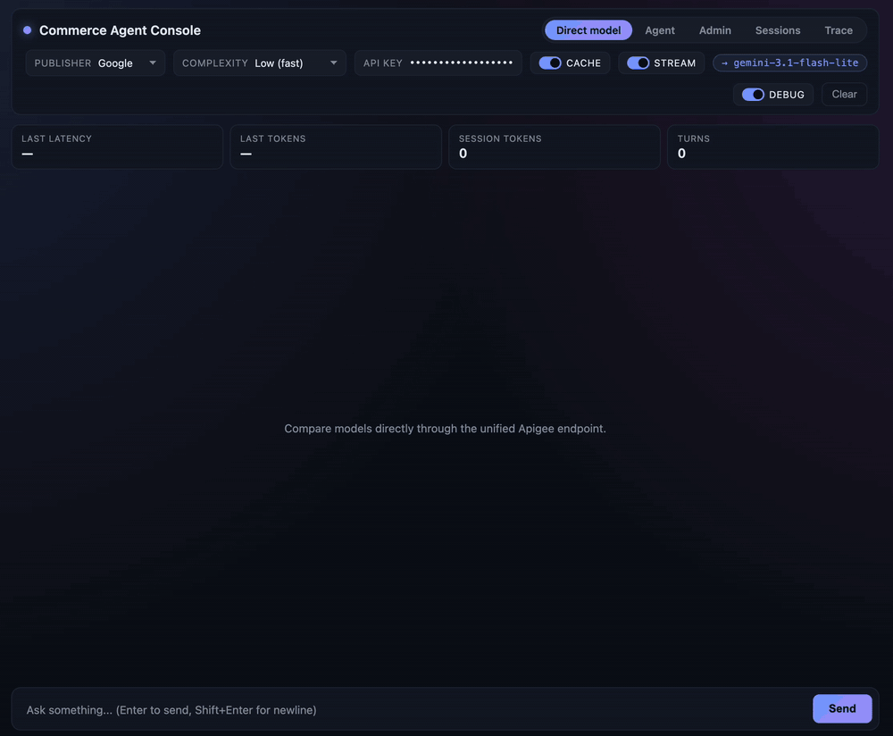
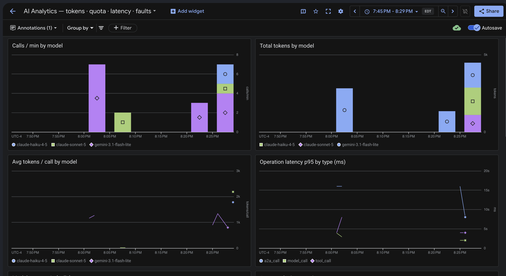
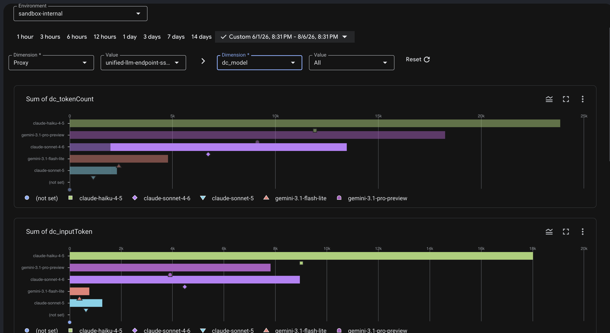
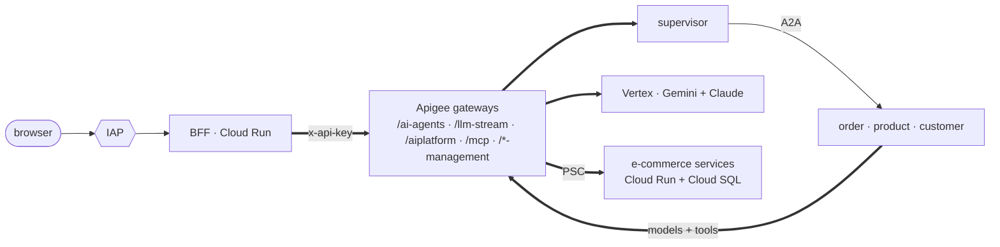

# A2A Multi-Agent Demo — Agent Engine × Apigee × Cloud Run

A complete, **replicable reference implementation of an enterprise-governed
multi-agent AI system** on Google Cloud. A supervisor agent on **Vertex AI
Agent Engine** delegates to three domain specialists over the **A2A
protocol**; **Apigee governs every data path** — model calls (Gemini *and*
Claude), MCP tool calls, the agents themselves, and the e-commerce backend the
tools query; and every hop lands in **one observability pane**, correlated by
a single trace id.

This is not a toy: real security boundaries (IAP identity, IAM-only services,
PSC-private networking, per-user API keys and token quotas), real cost/token
accounting, and tooling that rebuilds the entire stack **from three empty
projects** — project names live in one file
([`demo-environment.yaml`](demo-environment.yaml)), desired state in three
manifests, and every tool speaks the same `--check`/`--apply` grammar.

🚀 **Deploying? [docs/GETTING_STARTED.md](docs/GETTING_STARTED.md)** is the
end-to-end runbook: prerequisites, then phases A–E (plus optional analytics).
Budget a few hours on fresh projects; most of it is watching provisioners
converge.

## What you get when you deploy it

- **An agent chat that shows its work** — ask a supervisor about orders,
  products or customers and watch it delegate live over A2A, each handover
  revealed as it happens, tokens streaming end-to-end.
- **Direct model chat on governed keys** — Gemini and Claude behind the same
  gateway, each user on their **own** API key with token quotas, issued and
  bound to their signed-in identity.
- **A Trace Explorer** — pick any recent transaction and watch it replay
  across the full 3-project topology: an animated packet dwelling on each hop
  in proportion to its measured latency, with a waterfall and the raw logs.
- **Per-user session history** — sessions persist, replay, and roll up into an
  admin user→session→trace navigator.
- **Optional analytics dashboards** — tokens per model, per agent, per user in
  Apigee custom reports (auto-provisioned), and minutes-fresh platform metrics
  in Cloud Monitoring.

| | |
|---|---|
|  |  |
|  |  |

## Architecture at a glance

Three projects, one concern each: the **AI project** runs the agents and the
UI, the **Apigee project** governs, the **backend project** holds the business
system. Full topology, request lifecycles, security model and the rationale
behind every choice: [docs/ARCHITECTURE.md](docs/ARCHITECTURE.md).

And the complete wiring — every VPC, subnet, PSC leg, engine NIC and proxy,
including the Google-managed tenant projects most diagrams omit:

## The stack — what each component does and why it earns its place

### Agents — Vertex AI Agent Engine ([agents/](agents/README.md))

The AI plane: a **supervisor** plus three domain **specialists** (orders,
products, customers), each its own Agent Engine deployment.

- Delegation over the **A2A protocol** with true token streaming — the UI
  shows the handover the moment it happens, not after the answer.
- **Registry-driven discovery with per-turn self-heal**: the supervisor
  re-points to the newest live specialist every turn, so redeploying a
  specialist never requires touching the supervisor.
- **Per-user ACL** (Firestore, admin-editable in the UI) — the supervisor only
  delegates to agents the signed-in user may use.
- Specialists use **different models** (Gemini and Claude) behind the same
  gateway — one demo, two publishers, identical governance.
- Each agent holds one Apigee key (via Secret Manager) and one MCP tool
  subset: least privilege at the agent level.

### Apigee — the governance plane ([apigee/](apigee/README.md))

The demo's central argument: **every** model call, tool call, agent invocation
and backend API call crosses one gateway.

- **Per-user API keys bound to IAP identity** — a key whose owner doesn't
  match the signed-in user is rejected at the gateway.
- **LLM token quotas** per API product; quota state is logged with every call.
- **Model routing + SSE streaming** for both Gemini and Claude, plus an MCP
  gateway for tools and IAM-fronted paths to the backend services.
- **Enriched gateway logging** (tokens, quota counters, latency
  decomposition) and Data Collectors feeding Apigee's built-in analytics.
- Keys sync to **Secret Manager** — secrets flow gateway → vault, never
  through git.

### E-commerce backend — Cloud Run + Cloud SQL ([services/](services/README.md))

The real business system the agents ultimately query — three FastAPI
microservices sharing one MySQL database, seeded with sample data.

- **IAM everywhere**: services accept no unauthenticated traffic; the database
  user *is* the runtime service account (Cloud SQL IAM auth — no passwords
  anywhere in the stack).
- **Private-only path**: internal ALB → PSC service attachment → Apigee
  endpoint attachment. The backend has no public surface at all.
- **Stable custom audiences** so gateway↔service auth survives project
  renames.

### Frontend — BFF on Cloud Run behind IAP ([frontend/](frontend/README.md))

A FastAPI BFF serving the five-view UI: **Direct · Agent · Admin · Sessions ·
Trace**.

- **Fail-closed identity**: the BFF verifies the signed IAP JWT (never the
  spoofable headers); that one verified email becomes the Agent Engine user
  id, the ACL subject, the key owner, and the `user` field on every log line.
- Streams everything: SSE re-emission of the Agent Engine stream, live
  delegation reveal, a collapsed thinking panel, and a raw-event debug
  inspector.
- Admin views are pure **read-back of the logs** — the Trace Explorer and
  Sessions navigator add zero new telemetry.

### Observability — one pane, four logs, one trace id ([docs/OBSERVABILITY.md](docs/OBSERVABILITY.md))

- Four named logs (`front-`, `apigee-`, `agent-`, `services-ai-logs`), all in
  the AI project, all on one canonical schema, all carrying the same
  `traceparent` minted at the BFF — browser to database and back.
- The **Trace Explorer** reconstructs any transaction into an animated replay
  with a latency waterfall; a query cookbook covers the rest.
- The **optional [analytics/](analytics/README.md) module** adds the aggregate
  layer, fully provisioned: a Cloud Monitoring dashboard (minutes-fresh
  platform metrics) plus Apigee custom reports over the gateway's Data
  Collectors (tokens by model / user / app). Delete the directory and the core
  demo is untouched.

### Tooling — how it stays replicable ([docs/TOOLING.md](docs/TOOLING.md))

- **One environment file** names the projects; **three manifests** declare
  desired state; **seven check/apply tools** (plus the optional analytics one)
  converge live state to them.
- Every tool speaks the same grammar — `--check` (read-only drift report),
  `--dry-run`, bare (plan + confirm), `--apply` — so reruns are safe and
  auditing an environment is one flag.
- **Guard tests** fail the build on hardcoded project ids (code *and* docs),
  broken doc links, and cross-manifest disagreements.

## Patterns worth lifting

Even if you never deploy the demo, these are working, tested implementations
you can take apart:

- **A2A sub-agent streaming under ADK 2.3** — the exact client-factory and
  converter hooks it takes ([docs/A2A_INTEGRATION.md](docs/A2A_INTEGRATION.md)).
- **Registry self-heal** — surviving specialist redeploys with zero supervisor
  redeploys ([agents/my_supervisor_agent/](agents/my_supervisor_agent/README.md)).
- **Apigee as an LLM gateway** — per-user keys, token quotas, dual-publisher
  routing, streaming, token metering ([apigee/proxies/](apigee/proxies/README.md)).
- **End-to-end trace propagation** — one `traceparent` through IAP, gateway,
  engines, A2A hops and microservices
  ([docs/OBSERVABILITY.md](docs/OBSERVABILITY.md)).
- **The check/apply manifest grammar** — idempotent, honest-reporting
  provisioners you can audit with one flag ([docs/TOOLING.md](docs/TOOLING.md)).
- **Token analytics without a pipeline** — the gateway's Data Collectors feed
  auto-provisioned Apigee custom reports (tokens by model/user/app)
  ([analytics/](analytics/README.md)).

## What's in this repo

| Path | Purpose |
|---|---|
| [`demo-environment.yaml`](demo-environment.yaml) | **The** environment file — the only place naming the three projects, regions, and your admin identity |
| [`agents/`](agents/README.md) | The four agents, their manifest, and the agent provision/deploy tools |
| [`apigee/`](apigee/README.md) | The 7 proxy bundles ([catalog](apigee/proxies/README.md)), the org manifest, provisioning + proxy deploy tools |
| [`services/`](services/README.md) | The e-commerce backend: 3 microservices + Cloud SQL, manifest, provision/deploy tools |
| [`frontend/`](frontend/README.md) | The BFF: FastAPI on Cloud Run behind IAP, the five-view UI, `service.yaml` + deploy tool |
| [`analytics/`](analytics/README.md) | Optional analytics module: log-based metrics + Cloud Monitoring dashboard, provisioned Apigee custom reports |
| [`tests/`](tests/README.md) | Comparator tests + the consistency/guard rails (`pytest tests/`) |
| [`docs/`](docs/README.md) | Cross-cutting docs — index and reading map |

## Deploying

Edit `demo-environment.yaml`, then run the phases in
[docs/GETTING_STARTED.md](docs/GETTING_STARTED.md): backend → gateway →
agents → frontend → smoke test (+ optional analytics). At the end you have
the five-view UI live behind IAP, per-user keys issued, and every surface in
the screenshots above. Every tool is manifest-driven and speaks the same
grammar — `--check` (read-only drift report), `--dry-run`, bare
(plan + confirm), `--apply` — so rerunning anything is safe, and auditing a
live environment is just `--check`. The model behind it:
[docs/TOOLING.md](docs/TOOLING.md).

## Conventions

- **No secrets in git.** The repo stores secret *names* and key→secret
  wiring; values live in Secret Manager, synced from Apigee by the tools.
  `.env` files are gitignored at every depth (and optional — manifests carry
  the config).
- **No project ids outside `demo-environment.yaml`.** Manifests use
  `${tokens}`, deployables use `__TOKENS__` rendered at deploy time, and
  guard tests fail on violations — documentation included.
- **One service account per concern.** Per-agent runners, a BFF runner, a
  dedicated ecommerce invoker, per-purpose deploy SAs — all declared in
  manifests, all reconciled by the tools.
- **Fix forward.** Never hand-edit cloud resources the tools own; change the
  manifest and re-apply. Superseded files are deleted, not archived — git
  history is the archive.
- **Python ≥ 3.11**; install the two pinned requirements files
  ([GETTING_STARTED — toolchain](docs/GETTING_STARTED.md#4-local-toolchain)).

## License

[Apache 2.0](LICENSE). A demo/reference implementation — deploy it, take it
apart, lift what you need.
