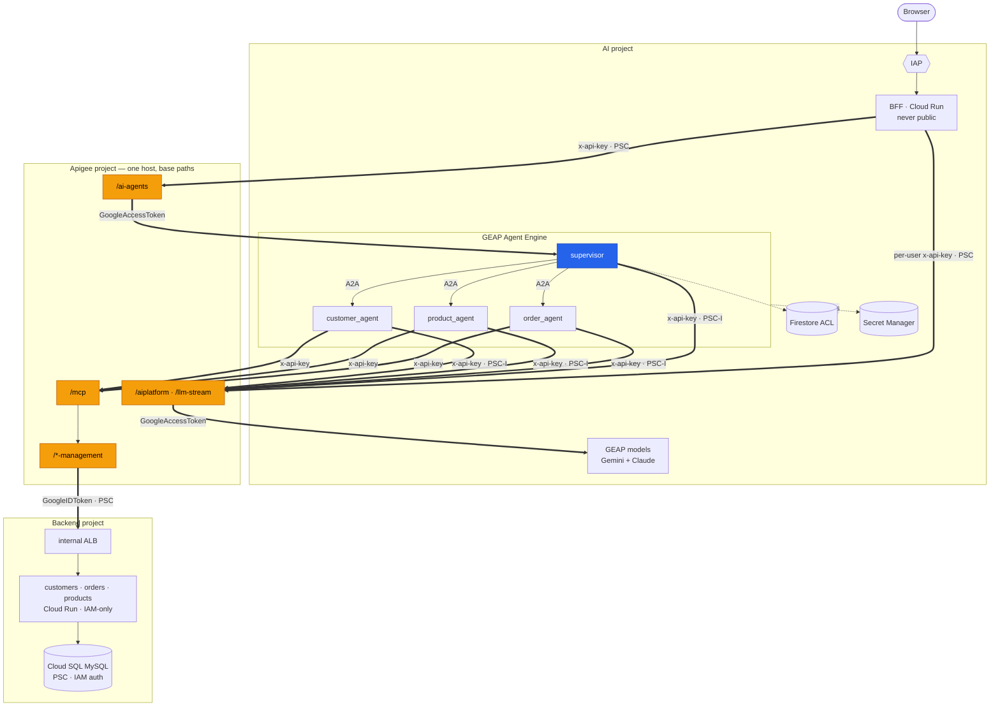
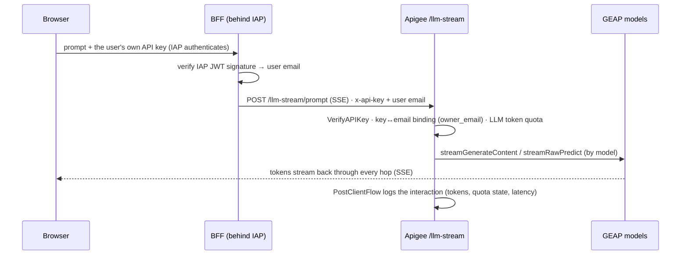
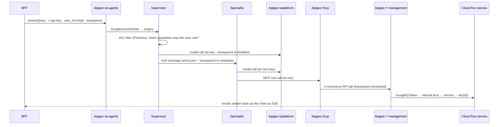

# Architecture

A distributed multi-agent system spanning **three GCP projects**: a supervisor
agent on **Gemini Enterprise Agent Platform (GEAP) Agent Engine** coordinates three domain specialists over
the **A2A protocol**; **Apigee sits in every data path** (models, tools, the
supervisor itself, and the e-commerce backend); and the business data lives in
a separate services project behind an internal load balancer that only Apigee
can reach. Every hop is on Google's private backbone.

This doc owns the *what and why*. The build sequence lives in
[GETTING_STARTED.md](GETTING_STARTED.md), the automation model in
[TOOLING.md](TOOLING.md), the logging/tracing story in
[OBSERVABILITY.md](OBSERVABILITY.md).

## The three projects

| Project (`demo-environment.yaml` key) | Runs | Why separate |
|---|---|---|
| `projects.apigee` | The Apigee X org: 7 proxies, API products + token quotas, per-agent/per-user keys | The gateway is shared infrastructure with its own lifecycle — orgs are long-lived and expensive to recreate |
| `projects.ai` | 4 Agent Engines, the BFF (Cloud Run + IAP), Firestore ACL, Secret Manager, **all** telemetry | The AI workload, plus the single pane where every component's logs and traces land |
| `projects.backend` | 3 FastAPI microservices (Cloud Run) + Cloud SQL MySQL behind a regional internal ALB | Simulates a separate line-of-business system the AI project has **no** direct access to — only Apigee can invoke it |

## Topology

The full detailed wiring — all three projects plus the Google-managed tenant
projects, both PSC chains (northbound into Apigee, southbound to the backend),
the engines' dual NICs, DNS peering, and every proxy:

The simplified logical view:

The Apigee surfaces are one runtime host with different base paths:

| Base path | Fronts | Caller → credential | Upstream credential |
|---|---|---|---|
| `/ai-agents` | The supervisor engine (sessions + `streamQuery`, rewritten to the full `reasoningEngines/…` resource) | BFF → app `x-api-key` | `GoogleAccessToken` (proxy deploy SA) |
| `/aiplatform` | Model calls from the **agents** | each agent → its own `x-api-key` | `GoogleAccessToken` |
| `/llm-stream` | Model calls from the **Direct view** (SSE; Gemini + Claude routed by model name) | end user → their personal `x-api-key` | `GoogleAccessToken` |
| `/mcp` | The MCP tool server | specialist → its `x-api-key` | (private MCP host) |
| `/customer-management` `/order-management` `/product-management` | The e-commerce services | MCP server | `GoogleIDToken` (dedicated invoker SA) |

Full proxy catalog with policies: [apigee/proxies/README.md](../apigee/proxies/README.md).

## Request lifecycles

### Direct view (user ↔ model, no agents)

### Agent turn (delegation → tools → services)

## Components

**Supervisor** (`agents/my_supervisor_agent`) — an ADK `Agent` in an `AdkApp`.
Model calls go through `ApigeeLlm` (the `/aiplatform` gateway), never native
GEAP. Sub-agents resolve in two layers: deploy-time warm start from Agent
Registry, plus a runtime step that re-points sub-agents at the newest registered
engine **every turn** from a TTL-throttled cache — so a redeployed specialist is
followed within ~60s with no supervisor redeploy. The per-user ACL filter
runs as a `before_agent_callback` (Firestore-backed, fail-closed) with a
`before_tool_callback` hard block as the safety net. A2A auth: an ADC-bearer
httpx client attached cloud-side to each `RemoteA2aAgent`.
Details: [A2A_INTEGRATION.md](A2A_INTEGRATION.md).

**Specialists** (`my_order_agent`, `my_product_agent`, `my_customer_agent`) —
each its own engine wrapped as `A2aAgent`, each with its **own** Apigee key,
each seeing only its domain's MCP tools (deliberately not merged: a small
tool surface keeps selection deterministic).

**BFF** (`frontend/`) — FastAPI on Cloud Run behind IAP, serving the five-view
UI: **Direct** (user's own key → `/llm-stream`, model picker incl. Claude),
**Agent** (supervisor chat via `/ai-agents`, streaming the delegation trace
live), and three admin-only views — **Admin** (Firestore ACL editing),
**Sessions** (user→session→trace navigator), and **Trace** (the correlation-trace
explorer). The BFF never calls `aiplatform.googleapis.com` directly.

**E-commerce services** (`services/`) — three FastAPI microservices sharing
one Cloud SQL MySQL database (IAM auth, PSC-only), IAM-locked to Apigee's
invoker SA, fronted by a path-routed regional internal ALB.

## Security model

- **The BFF is never public.** Cloud Run requires IAM invoker + IAP; identity
  is the **signature-verified IAP JWT email** — never a spoofable header.
- **One key per identity.** Each agent has its own Apigee app/key (delivered
  as a Secret Manager *reference*); each **end user** has a personal key whose
  `owner_email` must match their IAP email — someone else's key 403s.
- **Token quotas at the gateway.** Per-agent 100k tokens/hour; per-end-user
  10k/5min — counted from actual usage, enforced before the model call.
- **Per-user ACL, fail-closed.** No Firestore doc → no agent access; admins
  edit live in the UI; specialists are IAM-locked to the supervisor's SA so
  the filter cannot be bypassed.
- **Credential split by direction.** Consumers present `x-api-key`; Apigee
  mints upstream Google tokens as the *proxy's deploy SA* —
  `GoogleAccessToken` toward GEAP, `GoogleIDToken` toward Cloud Run. The
  ecommerce invoker SA's only power is `run.invoker` on the three services.
- **Stable custom audiences** (`https://<svc>.ecommerce.internal`) keep proxy
  bundles project-independent.
- **Database access is IAM** — the runtime SA *is* the DB user; no passwords,
  no public IP.

## Networking

Both cross-project paths are **Private Service Connect**:

**Northbound (AI → Apigee).** Engines egress through a PSC *interface*
(network attachment in `regions.ai`) into `ai-vpc`; the BFF uses Direct VPC
egress into the same VPC. A private DNS zone resolves `internal.apigee.com`
to a PSC endpoint targeting the Apigee instance's service attachment in
`regions.gateway`. Cross-region works because `ai-vpc` routes globally and the
endpoint allows global access. The Apigee instance must **accept** the AI
project (`consumerAcceptList` — provisioning patches it); a PENDING connection
is the classic "everything deployed but nothing connects" symptom.

**Southbound (Apigee → backend).** The internal ALB is published as a PSC
*service attachment*; an Apigee **endpoint attachment** consumes it, and the
`ts-ecommerce-services` target server resolves the attachment's host at
provisioning time. The connecting consumer is Apigee's Google-managed
*tenant* project, which the automation discovers and accepts.

**TLS on the private hostname.** `internal.apigee.com` is a private name, so
callers can't validate a public cert for it. The demo uses a **host-scoped
verification skip**: agents install a custom httpx transport that disables
verification *only* for the configured gateway hosts (all other egress keeps
full validation); the BFF does the same for its gateway URLs. Traffic never
leaves Google's backbone. A production alternative: a private CA, or a public
cert on a custom domain.

## Observability (summary)

Every component writes one structured entry per interaction into a **named log
in the AI project**, all carrying the same W3C `traceparent`: `front-ai-logs`,
`agent-ai-logs`, `apigee-ai-logs` (user, app, model, token counts, quota
state, 4-timestamp latency decomposition), `services-ai-logs`. (Apigee can
optionally export gateway spans to Cloud Trace too — off by default.) One
trace-id filter shows a whole turn across all four logs. Full reference:
[OBSERVABILITY.md](OBSERVABILITY.md).

## Why these choices

| Decision | Choice | Why |
|---|---|---|
| Front door | Apigee only | One governance point for models, tools, agents AND business APIs: keys, quotas, analytics, logging at the edge |
| Browser access | BFF + IAP for Cloud Run (direct) | A browser can't hold a Google credential; IAP gives verified identity without a manual LB; Cloud Run stays never-public |
| Streaming | SSE end-to-end | Delegations render the moment the supervisor emits them; Apigee streams with `response.streaming.enabled` |
| Agent Engine (managed) | vs self-hosted | No infra to run; built-in sessions, tracing, scaling |
| A2A between agents | standard protocol | Specialists independently deployable and reusable |
| Specialists not merged | one engine each | Small per-agent tool surface → deterministic tool selection |
| Per-agent SAs + keys | vs one shared identity | Per-agent attribution, quotas, and least-privilege IAM (the GEAP service agent is also restricted for A2A) |
| End-user model access | app-per-user + `owner_email` binding | Per-user attribution/quota, and a stolen key is useless without the matching IAP identity |
| ACL enforcement | supervisor callback + Firestore | Instant revoke, fail-closed, composes with runtime discovery |
| Cross-project connectivity | PSC both directions | Private by construction; no VPN/peering; each side controls acceptance |
| Cloud SQL access | PSC + IAM DB auth | No passwords, no public IP; the SA *is* the DB user |
| Replicability | one environment file + manifests + converging tools | Rebuilding any project = edit `demo-environment.yaml`, run the tools ([TOOLING.md](TOOLING.md)) |
| Registry | GEAP Agent Registry + auto-registration | The supervisor discovers specialists at deploy AND on a runtime TTL — redeploys heal themselves |
