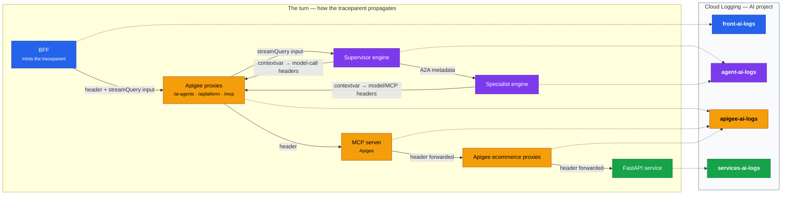
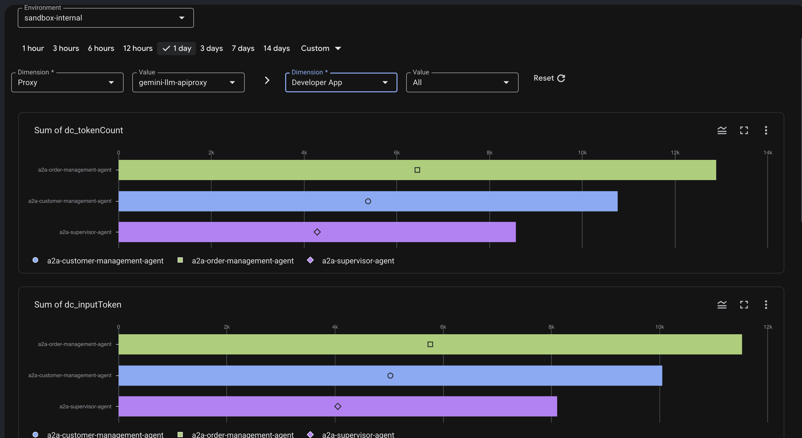

# Observability — one pane, four logs, one trace id

Everything this demo does — a browser turn, the supervisor's model calls,
delegations, MCP tool calls, the e-commerce API hits, the microservice work —
lands in the **AI project's** Cloud Logging and Cloud Trace, correlated by a
single W3C `traceparent`. This doc is the reference for what gets logged
where, what each record contains, and how to read a turn.

Canonical neighbors: [ARCHITECTURE.md](ARCHITECTURE.md) for the topology the
telemetry describes; [OPERATIONS.md](OPERATIONS.md) for day-2 toggles.

## The four named logs

All in the AI project (`demo-environment.yaml → projects.ai`), one log name
per component so the origin of any entry is obvious at a glance:

| Log name | Written by | One entry per | Written as | Key fields |
|---|---|---|---|---|
| `front-ai-logs` | The BFF (`frontend/app/tracing.py`, CloudLoggingHandler) | UI turn / notable event | `bff-runner` SA | `event`/`component`, `view`, `user`, `userMessage` + reply (truncated — the **only** place bodies are logged), `latency_metrics`, `error` |
| `agent-ai-logs` | The four engines (shared logging setup in `agents/a2a_common/`) | engine log record | each agent's SA | engine `DISPLAY_NAME`, structured `model_call` / `agent_turn` / `tool_call` / `a2a_call` entries (each with `latency_metrics`) |
| `apigee-ai-logs` | All 7 proxies (`ML-interaction` MessageLogging in PostClientFlow) | gateway interaction | the proxy's deploy SA | see the field reference below |
| `services-ai-logs` | The 3 FastAPI services (`services/*/app/ailog.py` middleware) | HTTP request (skips `/health`) | `ecommerce-sa` (cross-project logWriter) | `event`/`component`, `service`, `verb`, `path`, `status`, `latency_metrics`, `traceparent` |

Logs Explorer starters:

```text
logName="projects/<ai-project>/logs/apigee-ai-logs"          # all gateway traffic
logName=~"ai-logs" AND "<trace-id>"                          # one turn, all components
logName="projects/<ai-project>/logs/apigee-ai-logs" AND jsonPayload.user="<email>"
```

## Record shapes per component

### The canonical schema (every component)

Every record — BFF, engines, gateway, services — shares one envelope so fields
that mean the same thing have the same name:

- **`event`** — the record type: `turn` · `agent_turn` · `model_call` ·
  `tool_call` · `a2a_call` · `gateway` · `service_request`.
- **`component`** — `bff` · `engine` · `gateway` · `service`.
- **`traceparent`** — the W3C string (also on the entry's `trace` attribute).
- **`latency_metrics`** — the ONE home for timing, all epoch-ms:
  `receivedAt` (operation start), `respondedAt` (end), `latencyMs`
  (`respondedAt − receivedAt`; the gateway omits it and the reader derives it),
  and gateway-only `backendSentAt` / `backendReceivedAt` (the upstream-wait
  window). Per-component identity/body fields hang off the same envelope.

### `front-ai-logs` — the BFF (one per UI turn)

Bodies appear **only here**, truncated:

```json
{
  "event": "turn",
  "component": "bff",
  "view": "agent",
  "user": "user@example.com",
  "userMessage": "show me 10 products…",
  "traceparent": "00-<trace-id>-<span-id>-01",
  "latency_metrics": {
    "receivedAt": 1783383466331,
    "respondedAt": 1783383478684,
    "latencyMs": 12353
  },
  "error": ""
}
```

`view` is `direct` / `agent` / `admin`; `error` carries
the upstream failure verbatim when a turn dies (these entries are how the PSC and quota incidents
in GETTING_STARTED's troubleshooting table were diagnosed).

### `agent-ai-logs` — the engines (one per log record)

Mostly the agents' Python log records routed through `CloudLoggingHandler`
(`textPayload`, `labels.python_logger`, the `trace` attribute) — narrative
between the structured entries. **Four** record types are structured, each in
the canonical envelope, so an agent turn has no unattributed latency gaps:
`model_call` (per model call, tokens + latency), `agent_turn` (the agent's
whole run), `tool_call` (each MCP/tool invocation), and `a2a_call` (each
delegation round trip, from the caller's side). The `model_call`:

```json
{
  "event": "model_call",
  "component": "engine",
  "engine": "a2a-order-agent",
  "agent": "order_agent",
  "user": "user@example.com",
  "session_id": "6521816785669324800",
  "agentSessionId": "42a32bf2-0d9e-4e02-a63a-82689606f2cd",
  "promptTokens": 2471,
  "outputTokens": 581,
  "totalTokens": 3052,
  "traceparent": "00-<trace-id>-<span-id>-01",
  "latency_metrics": {
    "receivedAt": 1783383478406,
    "respondedAt": 1783383478684,
    "latencyMs": 278
  }
}
```

`agent_turn` / `tool_call` / `a2a_call` carry the same envelope plus `tool` or
`targetAgent`; the Trace Explorer uses them to attribute the orchestration time
that the endpoint records (model, gateway, service) don't cover.

`session_id` is the **frontend (Agent Engine) session** — the conversation
the user is in — propagated supervisor→specialist over A2A metadata
(`adk_session_id`) so every agent's records key to the same user session.
`agentSessionId` is the specialist's OWN A2A session, logged only when it
differs (so a sub-agent's session is trackable *as part of* the user session);
the supervisor omits it, since its own session already is the frontend one.

The unstructured line records carry the trace only as the entry's `trace`
**attribute** (set by the logging handler from the turn's contextvar); the
`model_call` record also embeds the raw `traceparent` like every other
component's record. Its `latency_metrics` shows the model call **as the engine
experienced it** — compare
with the same call's gateway entry to isolate the PSC/network hop.

### `apigee-ai-logs` — the gateway (one per interaction)

The richest record — see the full field reference below.

### `services-ai-logs` — the microservices (one per HTTP request)

Small by design (`services/*/app/ailog.py` middleware); `trace` attribute set
from the forwarded traceparent:

```json
{
  "event": "service_request",
  "component": "service",
  "service": "products-service",
  "verb": "GET",
  "path": "/product-management/products",
  "status": 200,
  "traceparent": "00-<trace-id>-<span-id>-01",
  "latency_metrics": {
    "receivedAt": 1783383478661,
    "respondedAt": 1783383478680,
    "latencyMs": 19
  }
}
```

The gateway record still groups its 20+ fields into nested objects
(`llm`/`quota` + the shared `latency_metrics`); the BFF/service/agent records
are flatter — but they all share the same envelope and `latency_metrics`
names, so one clock and one field set span every component.

## The trace: how `traceparent` travels

The BFF **mints** a `traceparent` per turn and every hop propagates it
**in-band** (no infrastructure magic — every edge label below is code in this
repo). Dashed arrows show where each component writes its log entry, all
carrying the same trace id:



Color legend: each component is filled with the same color as the log it
writes — blue = BFF → `front-ai-logs`, purple = engines → `agent-ai-logs`,
amber = everything Apigee-side → `apigee-ai-logs`, green = services →
`services-ai-logs`. The MCP server runs inside Apigee; its tool calls land in
`apigee-ai-logs` via the `/mcp` proxy fronting it (and again via the
ecommerce proxy behind it), so it's amber like the rest of the gateway.

Every named-log entry both **records the raw `traceparent` field** and sets
the Cloud Logging **trace attribute**, so the Logs Explorer "show entries for
this trace" view and a plain-text trace-id search both work. Apigee can
**optionally** export gateway spans to Cloud Trace too (`traceConfig` in the
apigee manifest — commented out by default; needs a COMPREHENSIVE/legacy
env). The demo doesn't depend on it: the Trace Explorer and waterfall are
log-based, and the gateway's 4-timestamp latency decomposition is in every
`apigee-ai-logs` record.

## The gateway record (`apigee-ai-logs` field reference)

One JSON entry per interaction, logged from `PostClientFlow` (after the
response — including streamed ones — has fully left the gateway, so logging
is never in the latency path). Fields are grouped into nested objects (`llm`, `quota`, `latency_metrics`) so Logs
Explorer renders them as collapsible nodes, and each proxy logs **only the
groups that apply** (no perpetually empty fields — the supervisor endpoint
has no `llm`/`quota`, the ecommerce proxies log the common core + `latency_metrics`):

| Group | Fields | Present on | Notes |
|---|---|---|---|
| core | `proxy`, `revision`, `verb`, `path`, `status`, `fault`, `error` | all 7 | which surface, which deploy, outcome |
| correlation | `traceparent`, `apigeeMessageId` | all 7 | |
| `latency_metrics` | `receivedAt`, `backendSentAt`, `backendReceivedAt`, `respondedAt` (epoch ms; `latencyMs` derived by the reader) | all 7 | see latency decomposition |
| identity | `user` (end-user email), `app` (calling Apigee app = which agent/BFF), `product` | LLM proxies (`app`+`sessionId` on the supervisor, `app` on MCP) | `user` arrives via IAP→BFF→gateway and A2A propagation |
| `llm` | `model`, `sessionId`, `inputTokens`, `outputTokens`, `totalTokens`, `thinkingTokens` (0 for non-thinking models) | the two LLM proxies | |
| `quota` | `allowed`, `used`, `available`, `exceeded` | the two LLM proxies | live token-quota counters at the moment of the call — every entry is a quota-pressure datapoint |

Example (an agent's Gemini call):

```json
{
  "proxy": "gemini-llm-apiproxy",
  "verb": "POST",
  "path": "/models/gemini-3.1-flash-lite:streamGenerateContent",
  "status": "200",
  "traceparent": "00-<trace-id>-<span-id>-01",
  "user": "user@example.com",
  "app": "agents-order",
  "product": "agents-models",
  "llm": {
    "model": "gemini-3.1-flash-lite",
    "inputTokens": "2471",
    "outputTokens": "581",
    "totalTokens": "3052"
  },
  "quota": {
    "allowed": "100000",
    "used": "14210",
    "available": "85790",
    "exceeded": "0"
  },
  "latency_metrics": {
    "receivedAt": "1783383478406",
    "backendSentAt": "1783383478409",
    "backendReceivedAt": "1783383478682",
    "respondedAt": "1783383478684"
  }
}
```

### Latency decomposition

Templates can't do arithmetic, so the timestamps are raw; subtract at query
time (the Trace Explorer does this for you as the gateway/backend/drain split):

| Quantity | Formula (fields under `latency_metrics`) |
|---|---|
| Gateway overhead (request side) | `backendSentAt − receivedAt` |
| Backend / model time | `backendReceivedAt − backendSentAt` |
| Streaming / client drain | `respondedAt − backendReceivedAt` |
| Total | `respondedAt − receivedAt` |

Every component's record now carries a `latency_metrics` block in the same epoch-ms
clock — for one traced turn you can line up BFF turn boundaries, each
engine's model-call window, the gateway's four stamps and the service's
request window, and read off exactly where the time went (e.g. proxy
`backendSentAt→backendReceivedAt` minus the service's window = the ILB/PSC
path).

### Reading a turn: completion order, not request order

Components log **when they finish**: the service's middleware fires when its
response is done; the proxy's `PostClientFlow` fires after the response has
left the gateway. So in a timeline sorted by entry timestamp, the **deepest
hop appears first** — a `services-ai-logs` entry before its fronting proxy's
entry is correct, not causality violation. For request-side ordering use the
payload timestamps (`receivedAt`, `backendSentAt`).

One more artifact to expect: `services-ai-logs` shows one
`logging.googleapis.com/diagnostic` entry per container boot — the logging
library announcing itself. Harmless.

## The Agent Engine OTEL layer

Independent of the named logs, the engines export OpenTelemetry traces + log
events (model prompts/responses) via GEAP's built-in telemetry. Enabled by
default at deploy time (`agents/deploy_common.py::telemetry_env_vars()`):

| Env var | Value | Effect |
|---|---|---|
| `GOOGLE_CLOUD_AGENT_ENGINE_ENABLE_TELEMETRY` | `true` | master switch (traces + logs) |
| `OTEL_INSTRUMENTATION_GENAI_CAPTURE_MESSAGE_CONTENT` | `EVENT_ONLY` | full prompt/response as OTEL log events (`true` is invalid with the experimental semconv — `EVENT_ONLY` is the working value) |
| `OTEL_SEMCONV_STABILITY_OPT_IN` | `gen_ai_latest_experimental` | GenAI semantic conventions |
| `ADK_CAPTURE_MESSAGE_CONTENT_IN_SPANS` | `false` | content in events, not span attributes (PII + span size limits) |
| `OTEL_PYTHON_LOGGING_AUTO_INSTRUMENTATION_ENABLED` | `true` | stdlib log records attach to the active span |
| `OTEL_SERVICE_NAME` | the agent's display name | names the service in Cloud Trace |

Opt out per deploy (PII- or cost-sensitive environments):

```bash
DISABLE_DEFAULT_TELEMETRY=1 python agents/provision/deploy_agents.py <agent>
```

IAM: each runner SA needs `roles/cloudtrace.agent` + `roles/logging.logWriter`
(declared in the runtime manifest; granted by `provision_agents.py`). The
OTEL instrumentation packages are pinned in each agent's `pyproject.toml`.

Where it lands: Cloud Trace (per-turn waterfalls: agent run → model calls →
tool calls, service name = display name) and the
`gen_ai.client.inference.operation.details` log (full prompt/response
events). Apigee's exported spans appear in the same Trace UI, so a gateway
hop and the engine work that caused it share a waterfall.

## Cross-project grants (how logs land in ONE project)

Writers outside the AI project get `roles/logging.logWriter` **on the AI
project** via the apigee manifest's `telemetryGrants` (applied by
`provision.py apigee`): the AI proxies' deploy SA, the ecommerce proxies'
invoker SA, and the backend services' runtime SA. The services get the target
project from `AI_LOG_PROJECT` (injected from the manifest); if the client
library or grant is missing they fall back to stdout JSON — logging can never
take a service down.

## Query cookbook

```text
# 1. A whole turn, all four logs (grab traceparent from any front-ai-logs entry)
logName=~"ai-logs" AND "d99a4896db171a8d4330ef08aa2f65fd"

# 2. Quota pressure for one user over the last hour
logName=~"apigee-ai-logs" AND jsonPayload.user="user@example.com"
AND jsonPayload.quota.available!=""

# 3. Every model call an agent made, with token counts
logName=~"apigee-ai-logs" AND jsonPayload.app="agents-order" AND jsonPayload.llm.model!=""

# 4. Slow e-commerce requests
logName=~"services-ai-logs" AND jsonPayload.latency_metrics.latencyMs>200

# 5. Gateway faults (quota trips, auth failures)
logName=~"apigee-ai-logs" AND jsonPayload.fault!=""
```

## Trace Explorer & Sessions (admin UI)

The **Trace** tab in the BFF (admin-only, revealed by `is_admin` — same gate
as the Admin view) turns query #1 into a picture. It lists recent transactions
(all users, filterable by user/view) from the per-turn `front-ai-logs` anchor,
and for any one draws the **full 3-project topology with the touched
components lit**: an animated packet replays the journey with its dwell on each
hop **proportional to that hop's measured latency** (play/pause · 1×/2×/4× ·
scrub), a latency **waterfall** orders every span by its request-side start,
and each hop's **raw log record** is one click away.

It is pure read-back — no new telemetry is emitted. The BFF reads the four
logs live via the Cloud Logging API (`roles/logging.viewer` on the BFF runner,
declared in `agents/runtime-manifest.yaml`), with the same filter as query #1:
an OR over the four `logName`s AND (the `trace` attribute OR a free-text trace
id), so both the attribute-only BFF record and the raw-`traceparent` records
are pulled. Reconstruction lives in
[`frontend/app/trace_explorer.py`](../frontend/app/trace_explorer.py) as a pure
function (unit-tested in `tests/test_trace_explorer.py`); the routes are
`GET /api/admin/traces` and `GET /api/admin/traces/{trace_id}`.

The **Sessions** tab (same admin gate) is the navigator over the same data: a
collapsible tree of **user → session → trace → specialist sub-session** with
eager rollup counts (interactions per session, sub-sessions per trace and per
session, and the called models/agents as chips), built by `session_tree()` in
the same module and served at `GET /api/admin/sessions`. Clicking a trace jumps
to the Trace tab for that transaction.

The **latency-by-layer pie** (`Latency by layer · exclusive · sums to the turn`)
uses **self (exclusive)** latency, not cumulative hop time: a proxy's self =
`gatewayMs + drainMs`, and its `backendMs` wait is attributed to what it waited
on — the model (the LLM proxies' backend IS the inference time) or the backend
service. So `/ai-agents` shrinks from ~17s cumulative to its true ~95ms
overhead, and the model shows as the real cost. Time that no *endpoint* record
owns — agent orchestration, A2A transport, startup, SSE streaming — is
attributed from the `agent_turn` / `tool_call` / `a2a_call` records into **named
slices** (a boundary sweep that sums exactly to the turn), rather than one
residual blob. Graph nodes whose self is far below their cumulative show a green
`self …` line.

Two honesty notes carried into the UI: hops are ordered by **request-side**
timestamps (`receivedAt`), not log-emission order, so
the outer hop precedes the inner ones it caused (see the completion-order note
above); and the per-hop latencies are richest once the enriched records are
live everywhere — before then some hops lack a `latency_metrics` block and the replay
falls back to even cadence for those segments.

## Analytics (aggregate, near-real-time)

Where the Trace Explorer answers *"show me this one transaction"*, the analytics
layer answers *"tokens per model/user/app, latency, traffic, faults — over
time."* Every metric already lives in telemetry the demo emits, so this is a viz
layer, **not** a pipeline — no new telemetry, and (by design) **no new BFF
views**. Two surfaces, both fully provisioned: **Cloud Monitoring** (cross-
platform gauges over the four ai-logs) and **Apigee custom reports** (per-model
/ per-user depth over the gateway's Data Collectors).

**Cloud Monitoring (near-real-time gauges).** Five log-based metrics
([`analytics/log_based_metrics.json`](../analytics/log_based_metrics.json)) —
`ai_llm_calls` (pure counter → reliable throughput; no value extraction),
`ai_tokens_total` / `ai_quota_used` / `ai_latency_ms` (distributions → native
mean/p50/p95/p99), and `ai_gateway_faults` (counter) — feed one dashboard
([`analytics/dashboard.json`](../analytics/dashboard.json)) at ~1-min
granularity, plus optional alerting. It plays to what Monitoring is good at —
it's **cross-platform, not per-user** (that detail is the Apigee reports' job)
and all
**time-series charts** so every tile respects the dashboard time picker: calls/min
by model, **total tokens by model** (MQL `sum()` over the distribution — the only
way to get a summed total from a distribution metric), tokens/call mean+p95 by
model, **operation latency p95 by type** (`model_call`/`tool_call`/`a2a_call`/
`service_request`), model-usage mix, gateway faults by proxy, input-vs-output
tokens/call by model, thinking (reasoning) tokens/call by model (from the
gateway's new `llm.thinkingTokens`), and a gateway error-rate ratio (faults ÷
calls).

⚠️ **Latency honesty:** the Monitoring latency tile shows **per-event measured
durations** (labelled by `event`), *not* exclusive/self latency. It deliberately
excludes the rollup events (`turn` = end-to-end, `agent_turn` = a whole agent
run) so nothing double-counts; and note `a2a_call`/`tool_call` still include
their downstream work. **True exclusive per-component/self latency requires trace
reconstruction** — that is the Trace Explorer's job (its boundary-sweep pie), not
something a rolled-up metric can compute. Grouping by `component` (as an earlier
version did) was a false read: the `engine` bucket blended model/agent/tool/a2a
events into one meaningless average.
Two gotchas baked in: (1) the Apigee-sourced tiles pin **`resource.type="api"`**
because Apigee X double-emits every gateway log under `api` *and*
`deprecated_resource`, and Monitoring can't reduce across resource types; (2) the
latency tiles must **not** pin that — latency comes from the engines/services/BFF
(`aiplatform`/`cloud_run`), not the gateway. **Labels
are low-cardinality only** (`model`, `app`, `component`, `proxy`) — never `user`
email (cardinality blowup). **Per-user breakdowns are the Apigee reports' job.**

**Apigee custom reports (per-model / per-user depth).** The gateway's
DataCapture policies feed six org-scoped **Data Collectors** — `dc_model`,
`dc_user_id` (the IAP-verified email, strings → dimensions) and
`dc_tokenCount` / `dc_thoughtsTokenCount` / `dc_inputToken` / `dc_outputToken`
(integers → metrics) — into Apigee's built-in Analytics. Custom reports are
saved queries over that data, and they're **API-provisioned** from
[`analytics/apigee_reports.json`](../analytics/apigee_reports.json): tokens by
model, tokens by user (the per-user FinOps cut Monitoring can't do), tokens by
app (agent vs direct), model traffic over time, latency + errors by proxy. View
them in the Apigee console → **Analytics → Custom Reports** (pick environment +
time window → Run). This is the only surface that can break down by
high-cardinality **user** email.

 ⚠️ It needs the org's **Analytics add-on**
enabled — definitions create fine without it, but render no data (the tool
reports this as a finding; enabling is a manual, billing-affecting org step).

**Provisioning.** Everything is one tool
([`analytics/provision_analytics.py`](../analytics/provision_analytics.py),
same `--check` / `--apply` grammar as the other provisioners): it enables the
`monitoring` API, reconciles the log-based metrics + dashboard on the AI
project, and diffs/creates the Apigee custom reports on the org (keyed by
`displayName` — the report id is server-assigned). Run `--check` for a drift
report; `--apply` to reconcile. Details + caveats:
[analytics/README.md](../analytics/README.md).

The [query cookbook](#query-cookbook) above remains the hand-filter
complement for ad-hoc questions in Logs Explorer.

## Cost shape

Cloud Trace bills per span (engine OTEL; plus 0.5-sampled gateway spans only
if the optional `traceConfig` is enabled); Logging per GiB —
the interaction records are compact (~600 bytes), and bodies are only captured
at the BFF (truncated) and in the OTEL GenAI events (disable with the opt-out
above if that's a concern). The engines' OTEL export is the biggest logging
line item on chatty agents.
